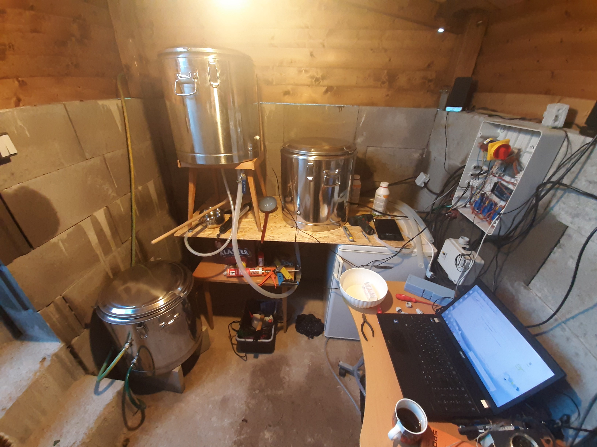
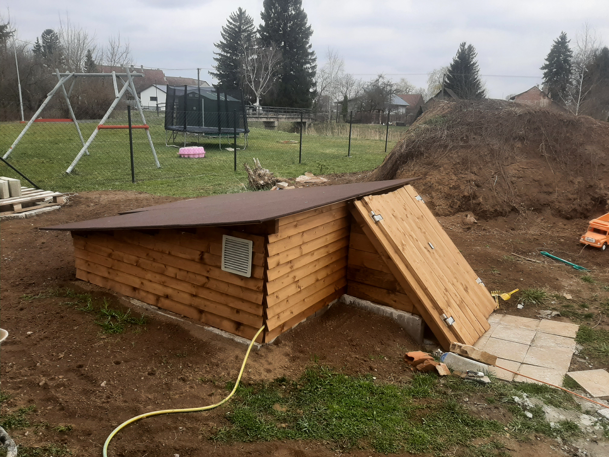
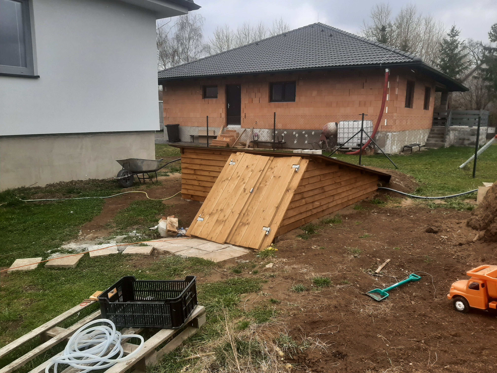

## Stavba pivovaru-sklípku

Abych vyřešil otázku místa pro varnu i potřebu zásoby vody, rozhodl jsem se zkombinovat dvě plánované stavby do jedné: **nádrž na dešťovou vodu** a **mini sklípek s varnou**.

### Popis stavby

Objekt tvoří tři propojené části:

1. **Nádrž na dešťovou vodu** – objem cca **15 m³**
2. **Sklípek** – temperovaný prostor pro ležení piva
3. **Varná místnost** – prostor pro vlastní vaření

Při výkopu bylo naraženo na **spodní vodu ve 2,2 m hloubky**.

### Výhody kombinované stavby

- Dešťová voda pro **chlazení mladiny** bez zbytečných ztrát pitné vody
- Pitná voda v bezprostřední blízkosti
- Předpřipravené kabelové rozvody pro automatizaci

### Náklady

| Položka | Cena |
|---------|------|
| Dřevo (bednění, stropy) | ~15 000 Kč |
| Ztracené bednění (212 ks) + roxory | ~21 000 Kč |
| Beton | ~4 000 Kč |
| Bagr (výkop) | ~2 500 Kč |
| **Celkem** | **~41 000 Kč** |

