## Building hop garden

Here is documentation of the hop garden building process. I built it in May 2022.

I planted 4 hop plants the previous autumn: 2× Žatecký poloranný červeňák (Saaz) and 2× Sládek. I bought them directly from the Hop Institute from Mr Brynda ([chizatec.cz](https://www.chizatec.cz)). Fortunately all of them survived and were thriving – time to build the support structure!

## Steps

**1. Cast concrete pillars**  
I inserted 10 mm threaded rods into the fresh concrete to avoid drilling later.

**2. Paint the timber**  
5 m × 100×140 mm construction timber (KVH), coated with wood preservative before installation.

**3. Drill holes and set pillars**  
Drill 20 cm diameter holes, 80 cm deep. Insert the concrete pillars and fill around them with compacted gravel.

**4. Mount the timbers**  
Place timbers onto the threaded rods and tighten.

## Parameters

| Parameter | Value |
|-----------|-------|
| Timber (KVH) | 5 m, 100×140 mm |
| Hole depth | 80 cm |
| Hole diameter | 20 cm (compacted gravel fill) |
| Spacing between plants | 140 cm |
| Distance between posts | 6 m |
| Main horizontal wire | 1.5 mm dia |
| Vertical training wires | 0.9 mm dia |

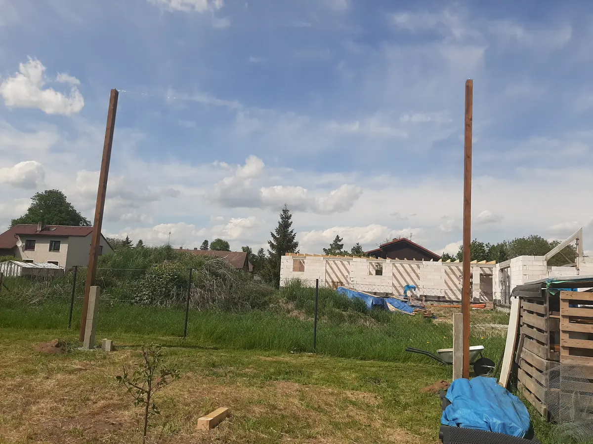
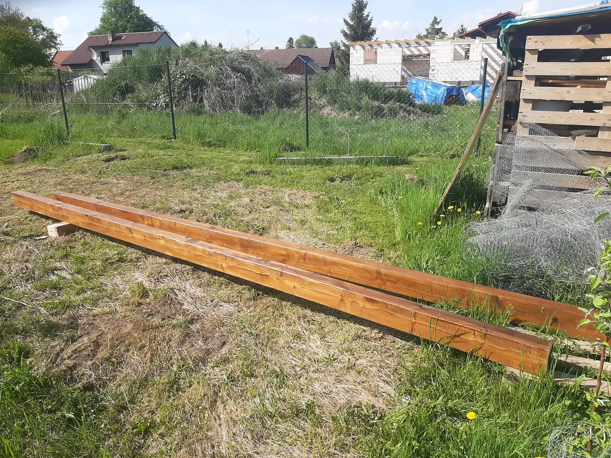
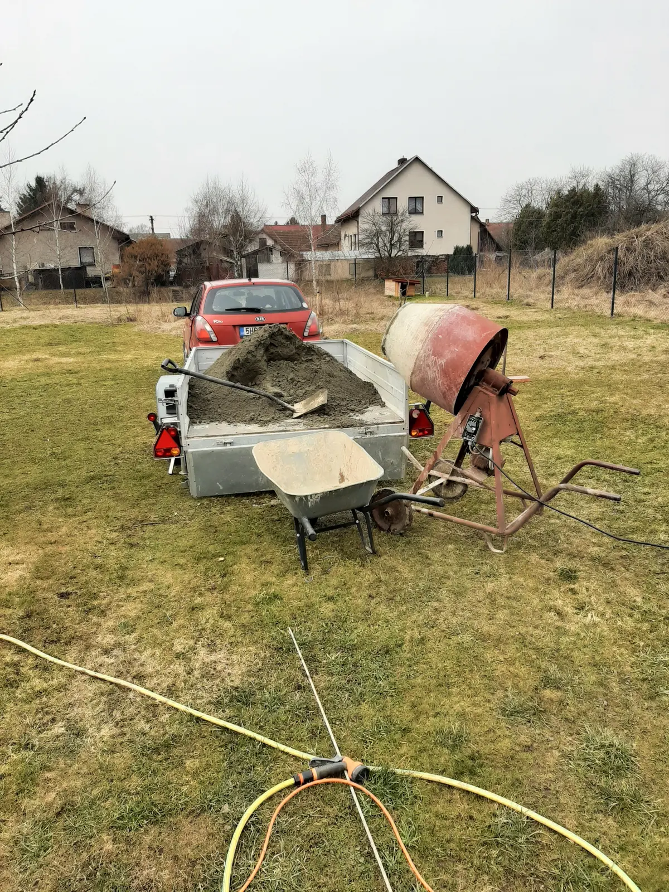
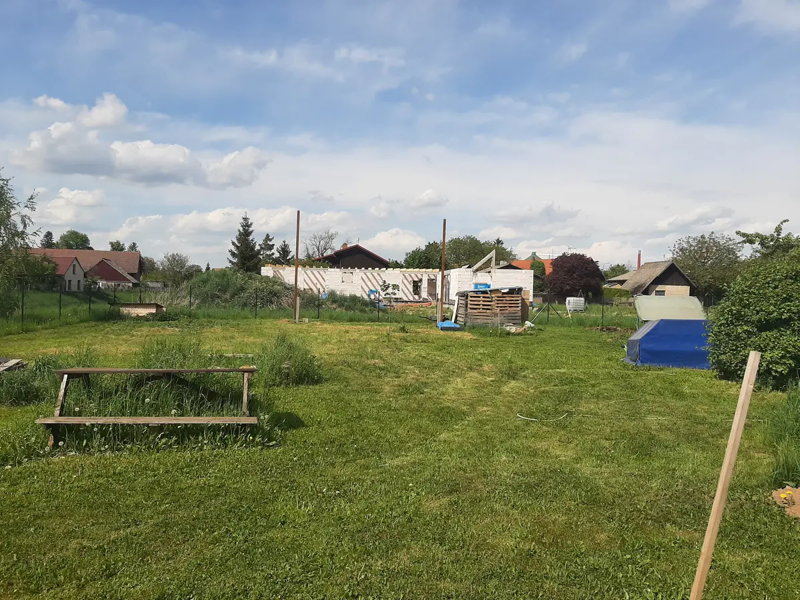
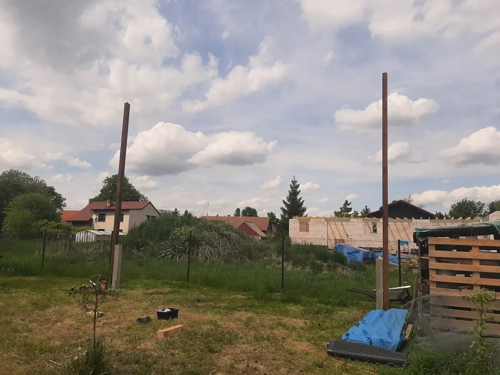
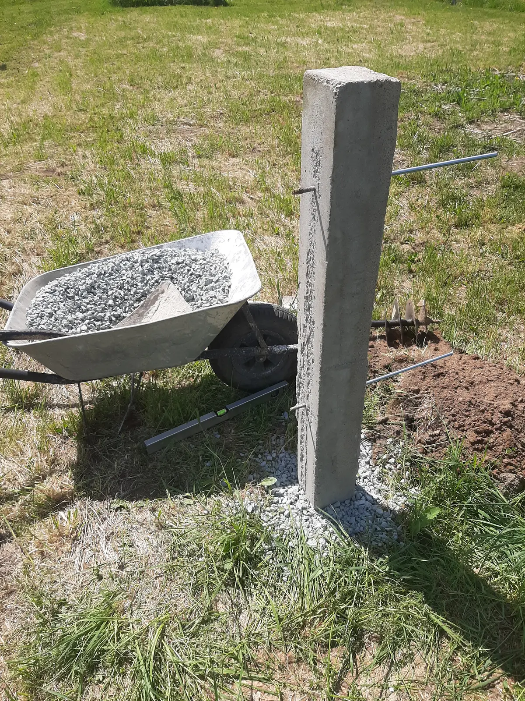
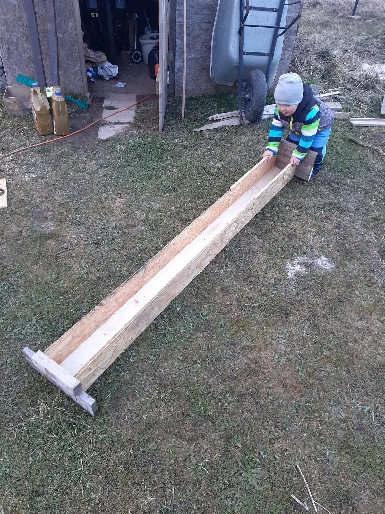
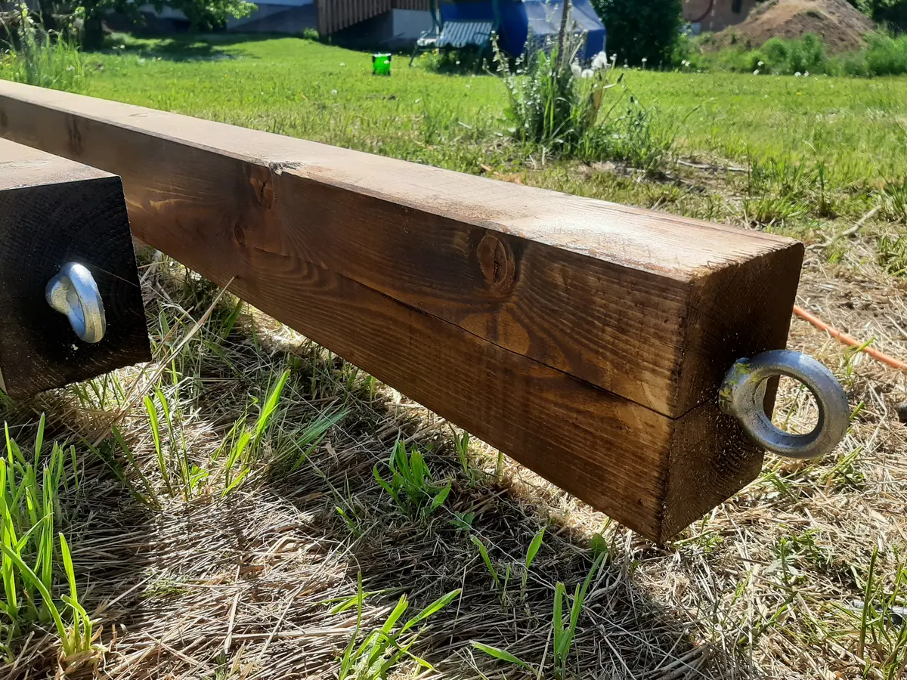
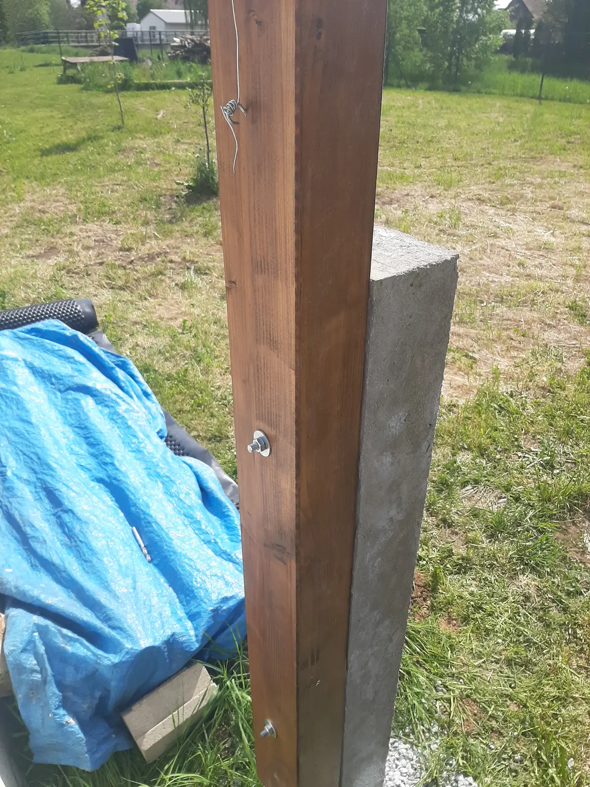
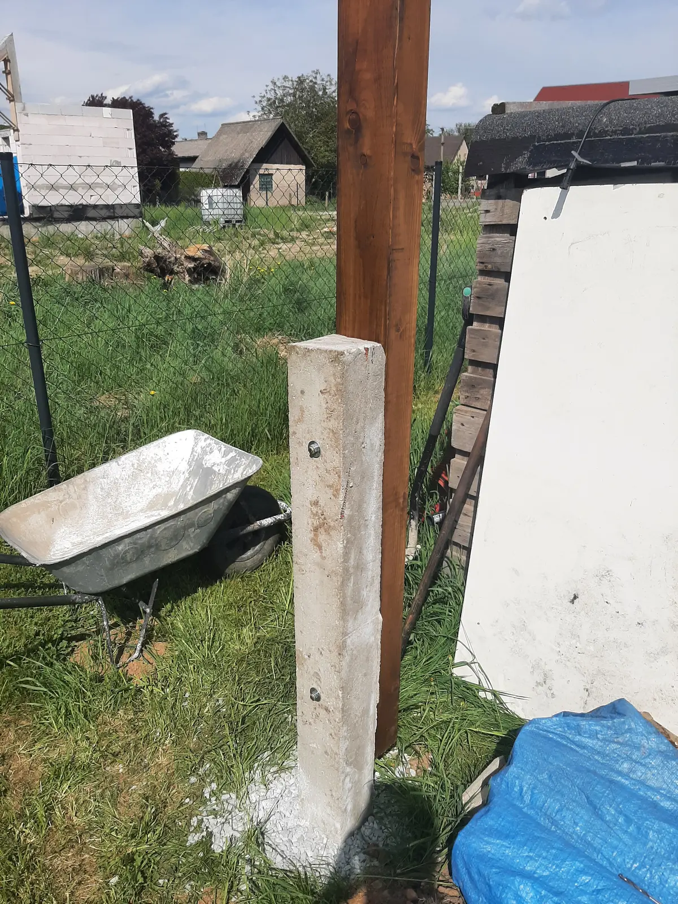
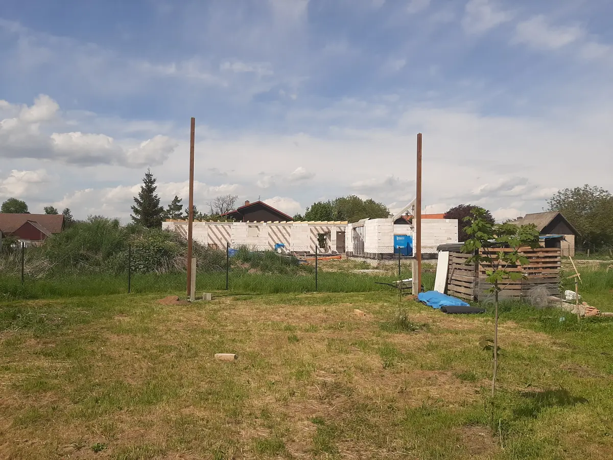
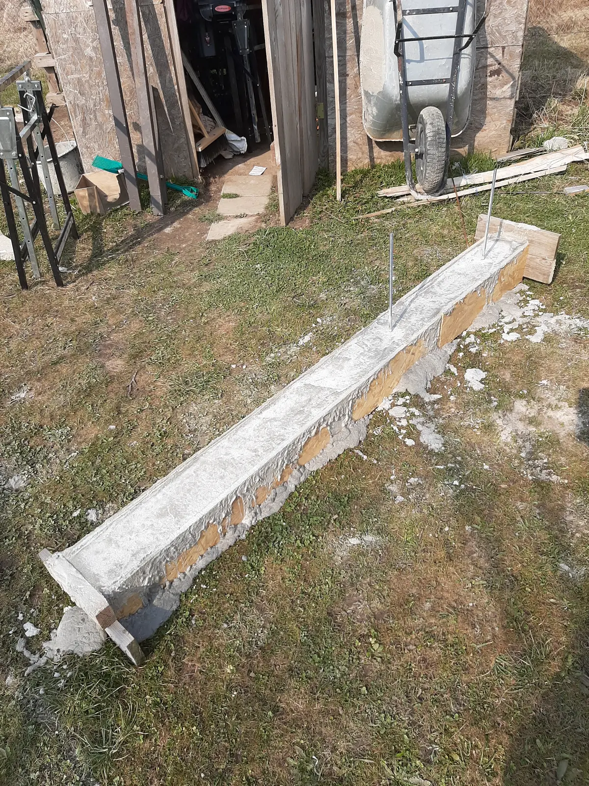
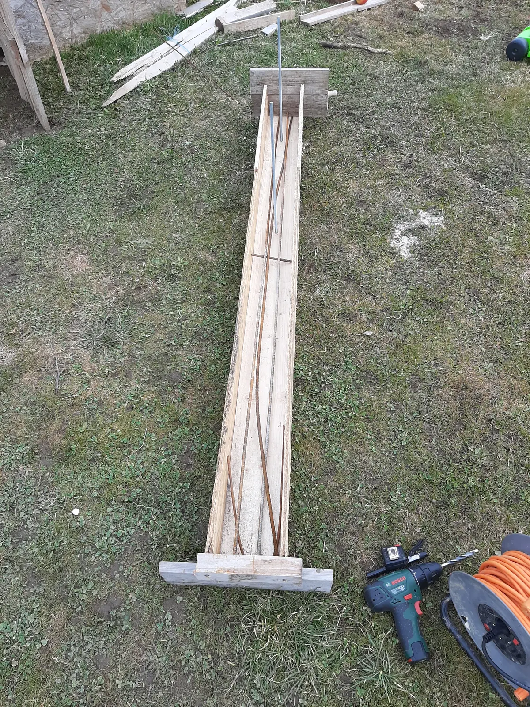

## Timelapse of hops growing


