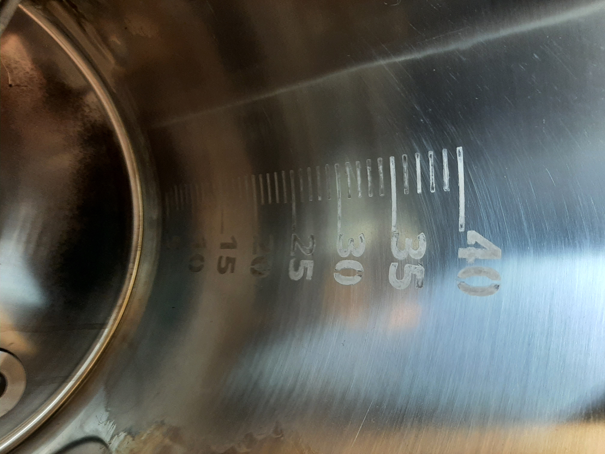
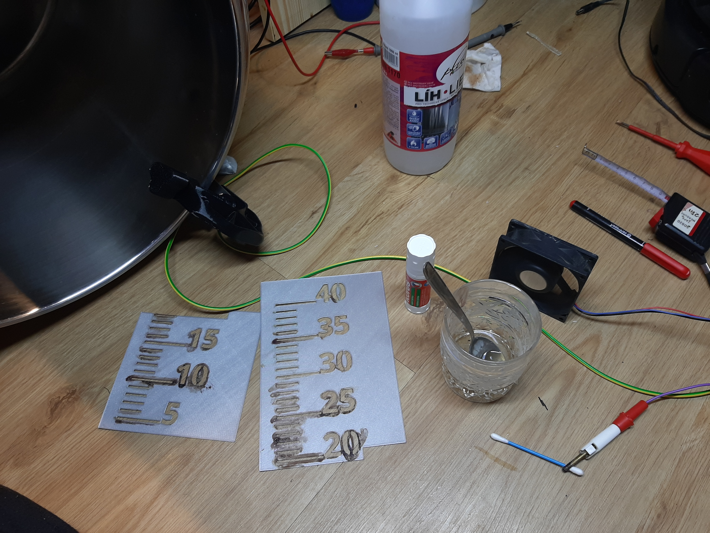
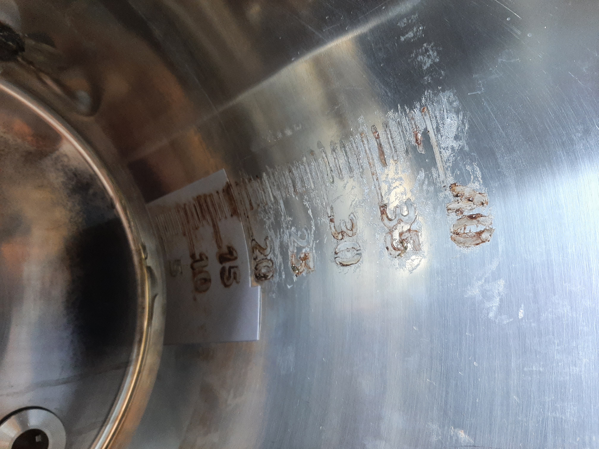
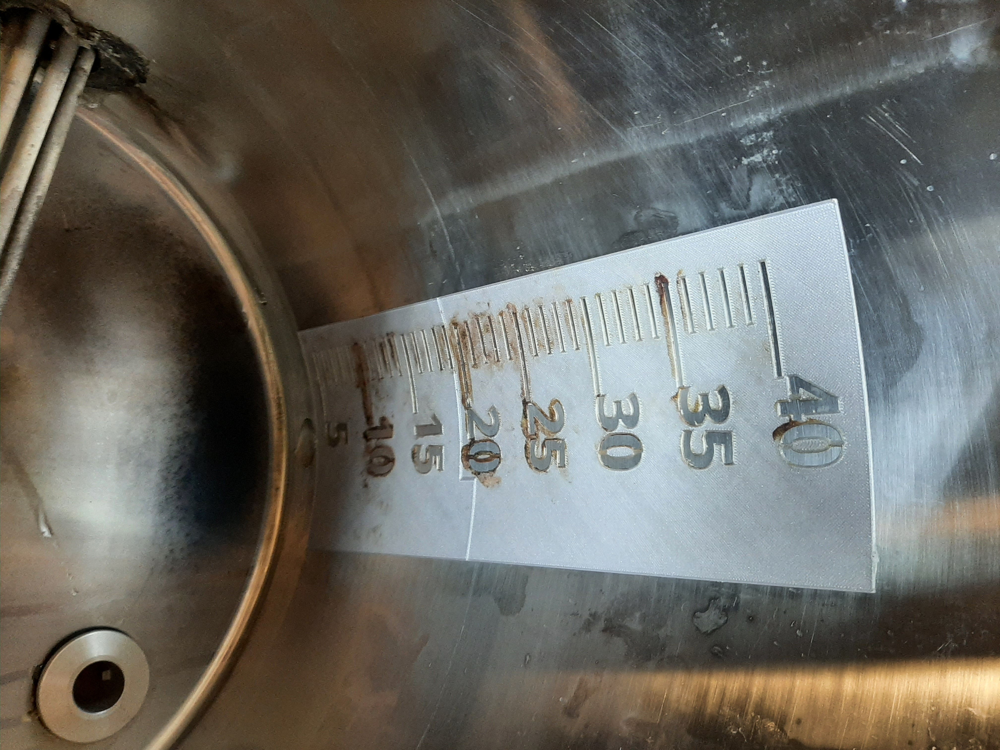

## Making scale on stainless pots

I first tried the method described at [cech-pivo.cz](https://www.cech-pivo.cz/cs/blog/56-cejchovani-hrnce). It worked, but the result was unsatisfying and it took too long. Working with duct tape to create the template was a nightmare – the tape doesn't conform well to a curved surface and the template shifts.

Why not use a **3D-printed template** instead? With this new method I successfully created scales for all 3 of my pots, all done before noon.

## Required tools

- Cotton swab
- Shot of vinegar
- Spoon of salt
- DC power supply – 12 V, up to 1 A is sufficient
- Stick glue (e.g. KORES)
- Ethanol for cleaning

## Procedure

1. Fill the pot with a known volume of water (e.g. 10 l) and mark the water level
2. Clean and degrease the pot surface with ethanol
3. Align the 3D-printed template with the mark and glue it in place
4. Connect **positive (+)** to the pot, **negative (–)** to a cotton swab soaked in the vinegar + salt solution
5. Press the swab into each hole in the template for ~5–10 seconds per mark
6. Remove the template and rinse

## Models

The template model is parametric – you will need to adjust it to match your pot diameter and desired scale range.

- [Parametric model – OnShape](https://cad.onshape.com/documents/3b5285c8e771676dbc97391e/w/b20166cc99900b7f86d25ebb/e/b7ad8022e80818e54c37f934?renderMode=0&uiState=6246c486d219ed77c1897c99)
- [3D model – Printables.com](https://www.printables.com/cs/model/162664-measuring-volume-scale-mask)

