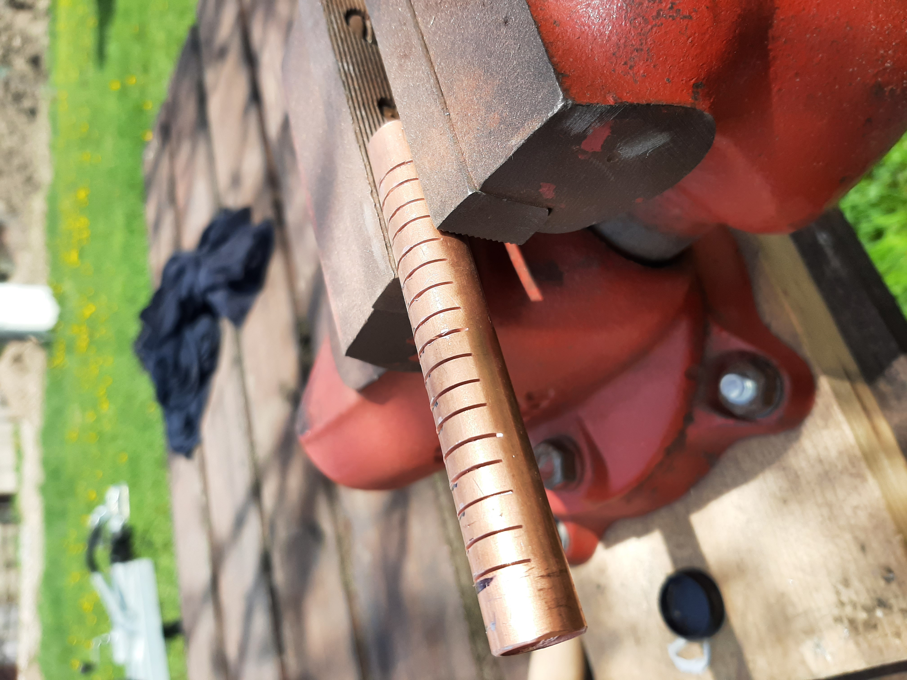
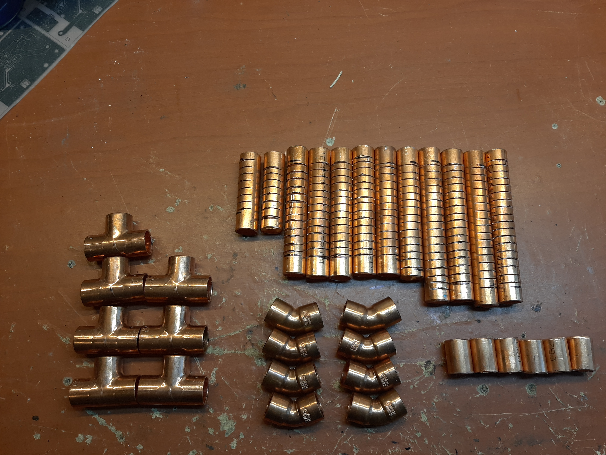
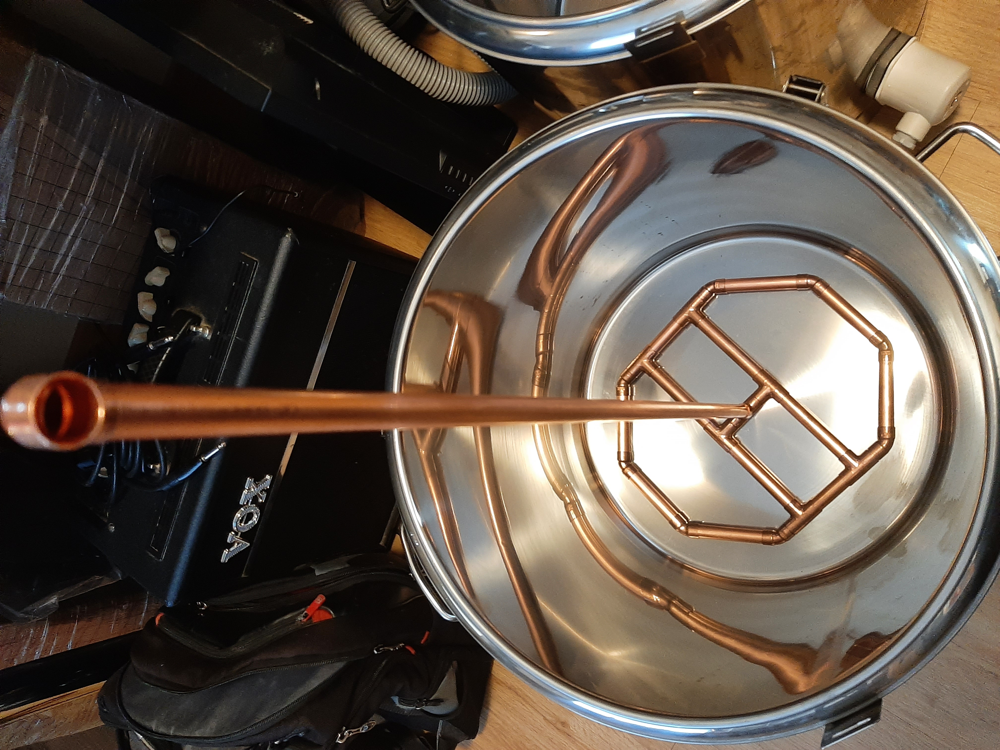
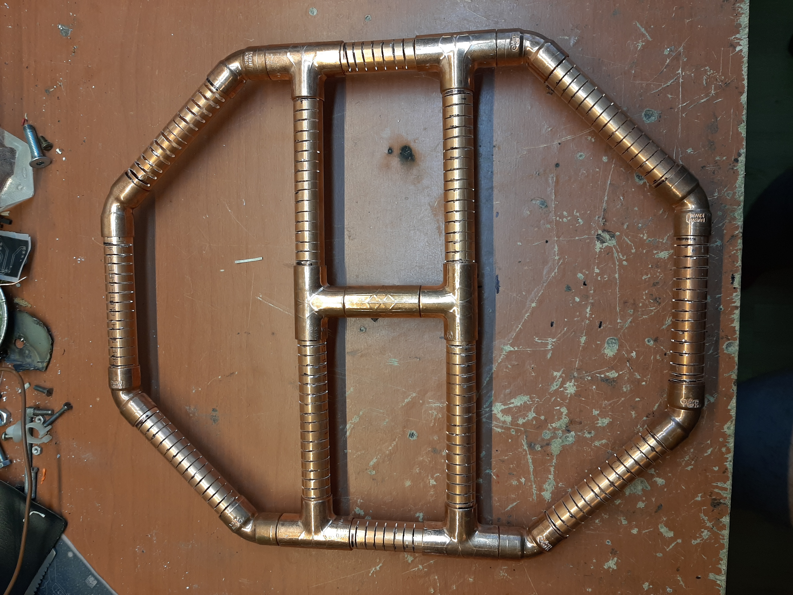
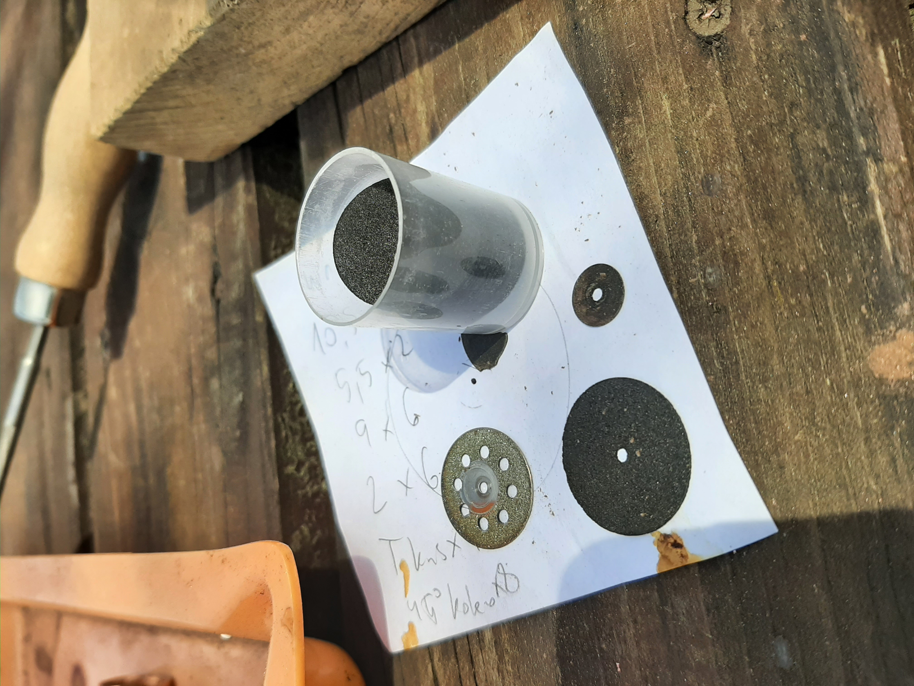

## Měděný manifold pro scezování

Manifold slouží jako alternativa k falešnému dnu nebo tzv. bazooce při scezování rmutové kaše. Výhodou je jednoduchost, nízká cena a snadná rozebíratelnost – díly nejsou spájeny, pouze zasunute do sebe.

### Parametry

- **Materiál:** Cu trubka 15×1 mm, celková délka 2 m
- **Cena:** cca **700 Kč**
- **Štěrbiny:** šířka cca **0,6 mm**, řezané mikrovrtačkou s brusnými kotoučky 0,5 mm

### Seznam dílů

Z 2 m trubky Cu 15×1 se vyrobí:

| Díl | Počet |
|-----|-------|
| Koleno 45° | 8× |
| T-spojka | 7× |
| Koleno 90° (volitelné) | 1× |
| Trubka 105 mm | 4× |
| Trubka 65 mm | 2× |
| Trubka 90 mm | 6× |
| Trubka 25 mm | 6× |

### Potřebné nářadí

- Ochranné brýle (**nutné!**)
- Úhlová bruska (flexa)
- Mikrovrtačka s brusnými kotoučky 0,5 mm / průměr 25 mm
- Kulatý pilník
- Svěrák

### Postup výroby štěrbin

Štěrbiny se řežou opatrně brusnými kotoučky v mikrovrtačce. Šířka 0,6 mm je kompromis – propustí tekutinu, ale zachytí zrno ze šrotu. Doporučuji práci provádět ve svěráku a vždy používat ochranné brýle – kotoučky jsou křehké a mohou se rozlomit.

