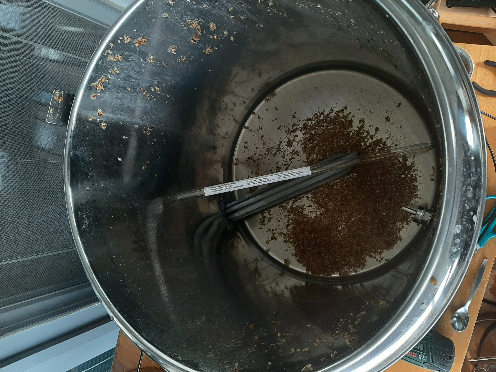
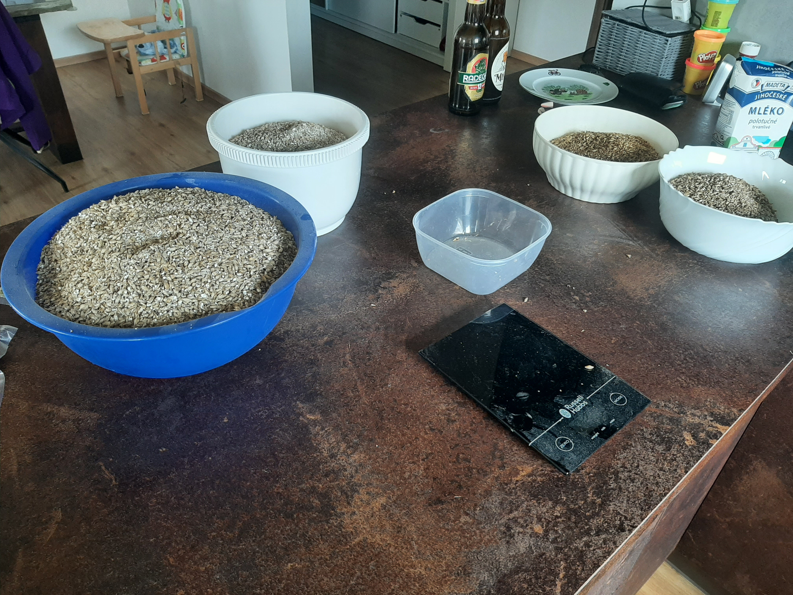
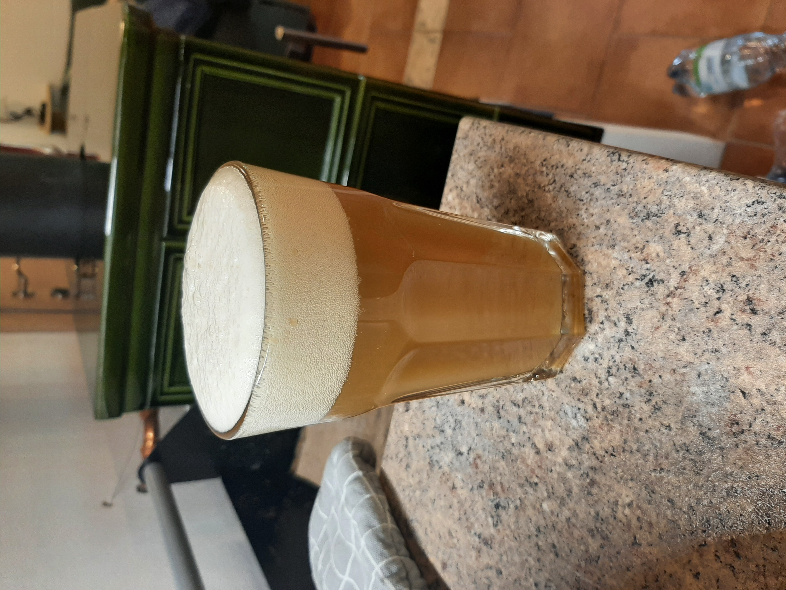
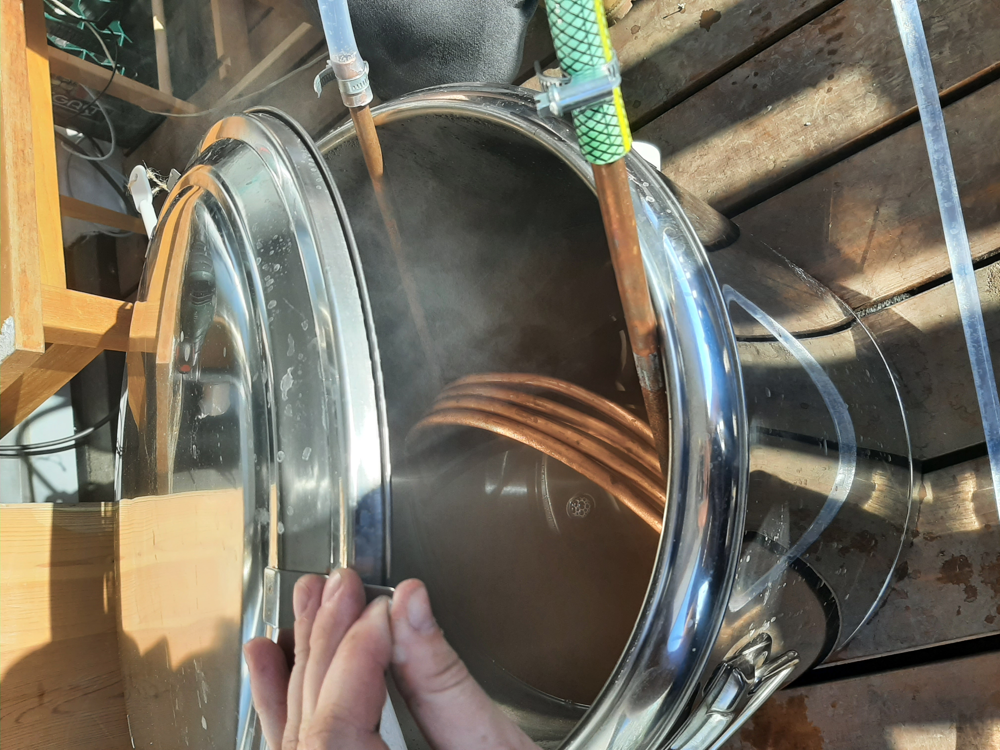
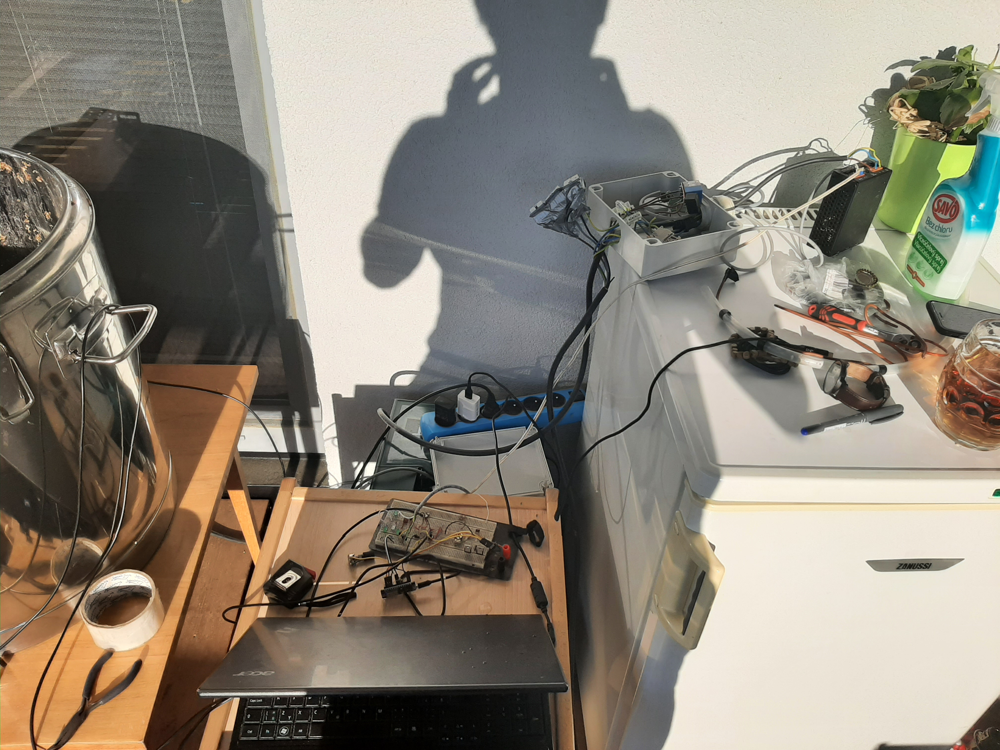
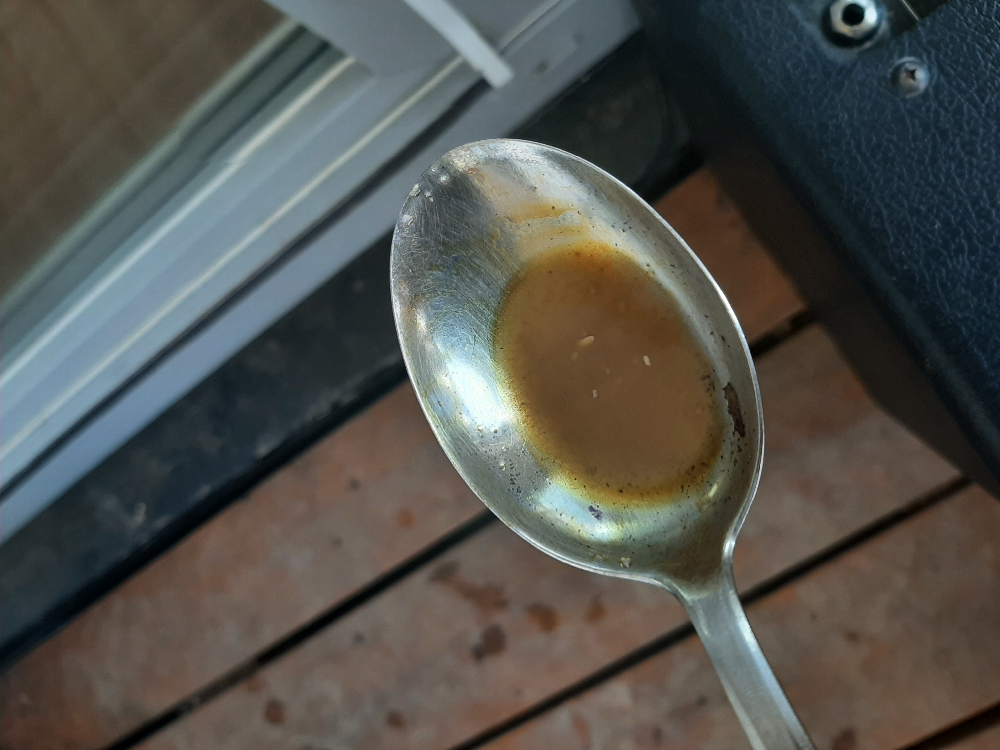
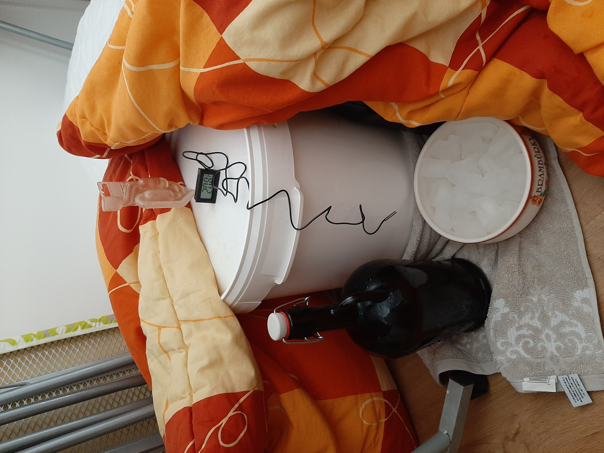
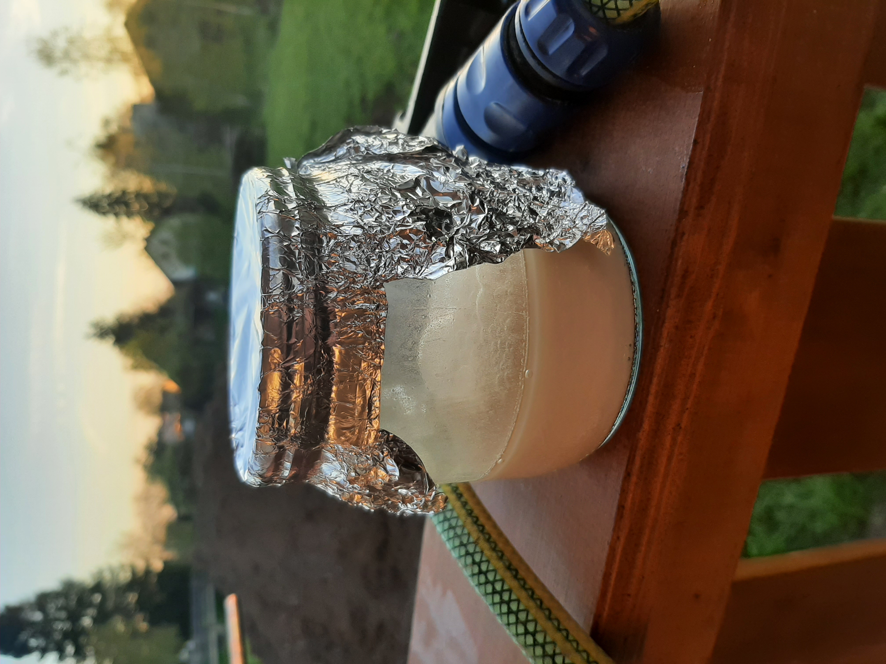

## První vaření – ALE 11° Lemondrop

Datum prvního vaření: **8. 5. 2021**  
Recept: **ALE 11° Lemondrop** (zdroj: [Pivotéka Tábor](https://www.pivoteka-tabor.cz/recepty/summer-ale-11-lemondrop/))  
Systém: **HERMS** s peristaltickým čerpadlem

---

### Problém č. 1 – Zlomený kabel teplotního čidla

Při přípravě se odhalil zlomený kabel u teplotního čidla. Dočasné řešení způsobilo komplikace při přesném sledování teplot.

### Problém č. 2 – Selhání čerpadla po hodině provozu

Peristaltické čerpadlo přestalo fungovat přibližně po hodině provozu. Příčinou bylo **rozbité kolečko planetové převodovky**. Cirkulace rmutové kaše se zastavila.

### Problém č. 3 – Pád proudového chrániče 30 mA

Vypadl proudový chránič s citlivostí 30 mA – pravděpodobně vlhkost nebo svodový proud z elektrického vybavení varny.

### Problém č. 4 – Pád jističe 20 A

Krátce po obnovení provozu vypadl i jistič 20 A, čímž se přerušil ohřev.

---

### Fermentace

Nestabilní teploty při rmutování způsobily nedostatečné zcukření škrobů.

### Výsledek

Výsledné pivo dosáhlo pouze **1–2 % ABV**. Přesto bylo oceněno jako **„chutné hořké nealko"**.

---

### Co z toho plyne

- Peristaltické čerpadlo není vhodné pro cirkulaci hustého rmutu
- Elektroinstalace varny potřebuje důkladnější revizi
- Teplotní čidla je třeba pravidelně kontrolovat

