## Sklizeň chmele 2022

V roce 2022 proběhla **první sklizeň** ze čtyř babek chmele vysazených v roce 2021.

### Výsledky sklizně

| Odrůda | Počet babek | Čerstvá hmotnost | Suchá hmotnost |
|--------|-------------|-------------------|----------------|
| ŽPČ (Žatecký poloraný červeňák) | 2 | 997 g | 360 g |
| Sládek | 2 | – | 458 g |

Sušení probíhalo na **půdě**, přirozeným prouděním vzduchu po dobu **5–7 dní**.

### Poznatky

> **Vždy používejte pytlíky na chmel!**

Bez pytlíků listy a zbytky chmele ucpávají ventily. Pytlíky na chmel tento problém zcela eliminují.

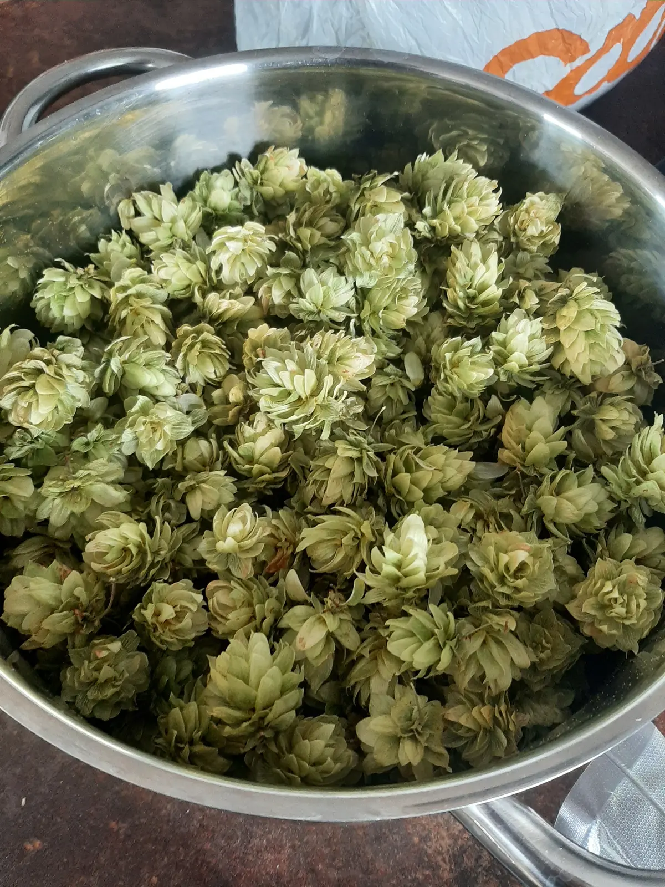
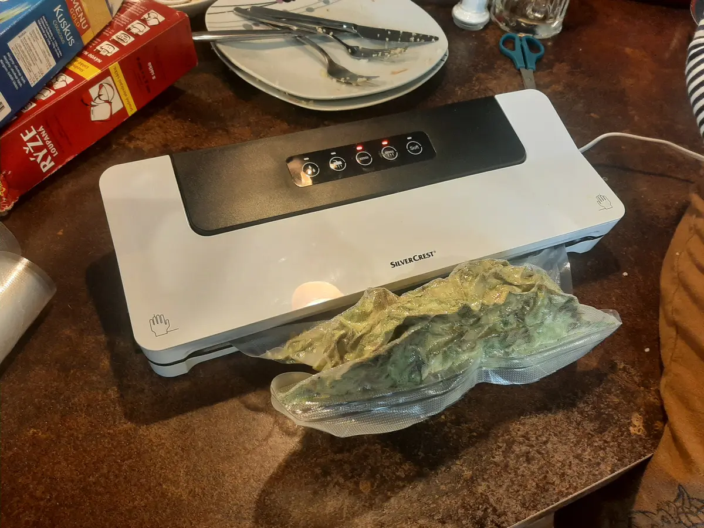
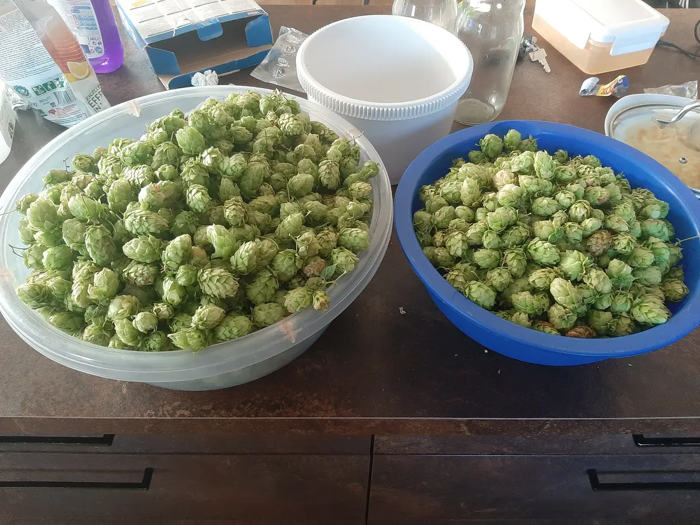
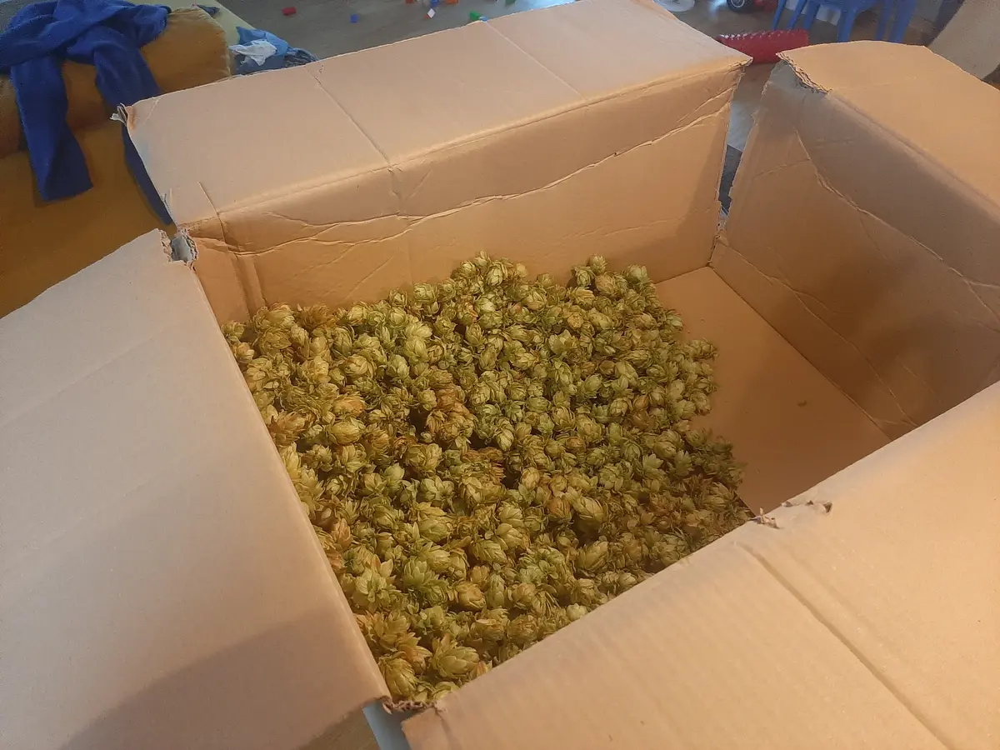
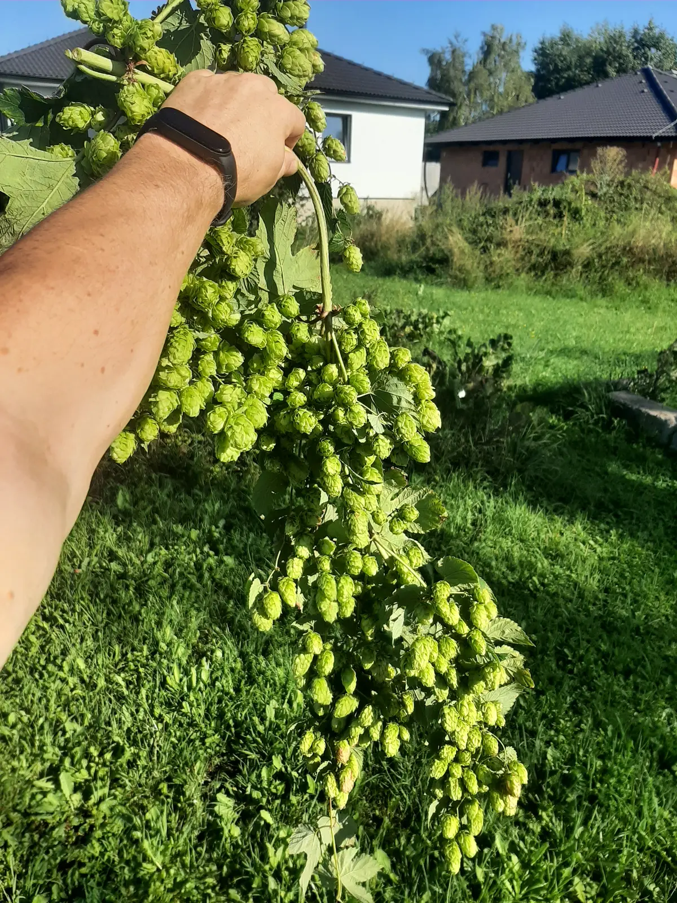
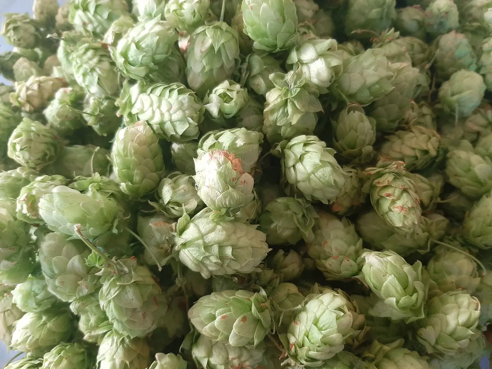
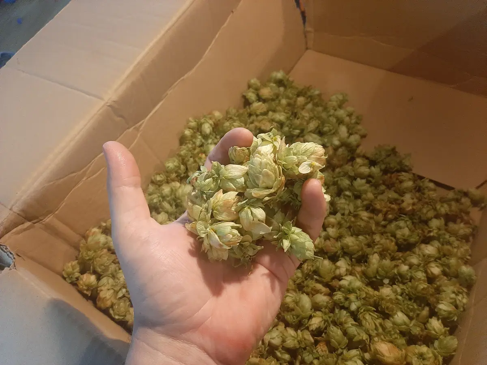
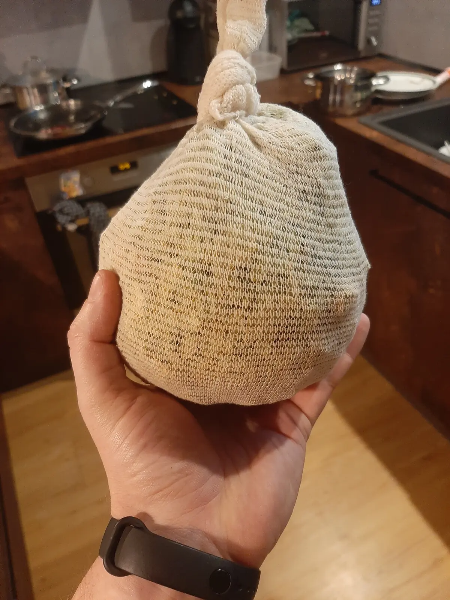
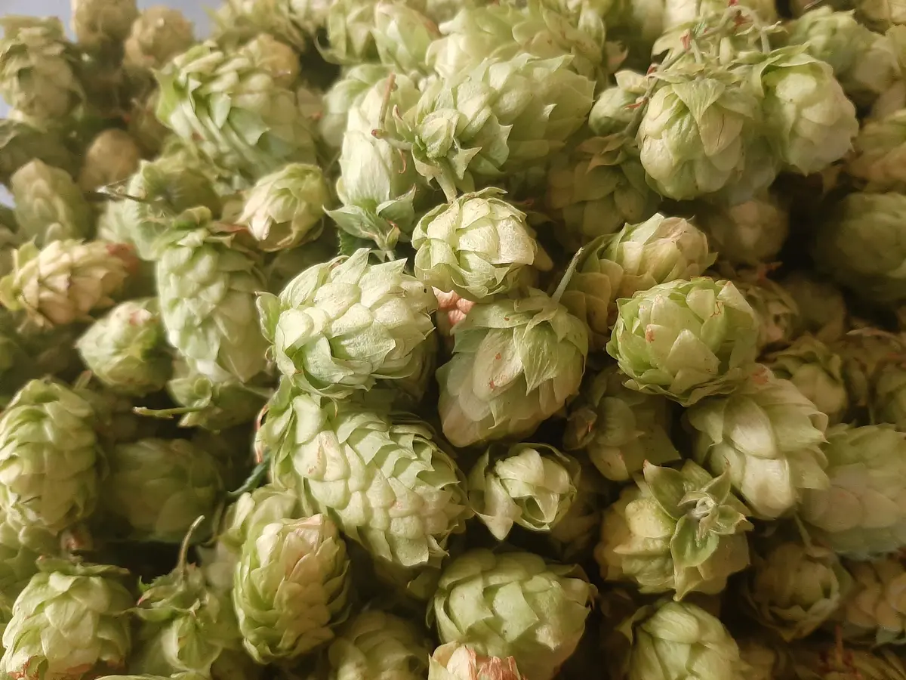
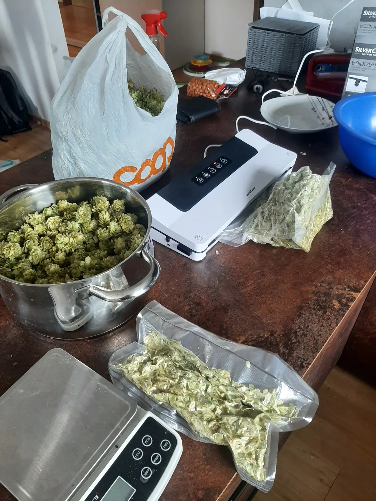
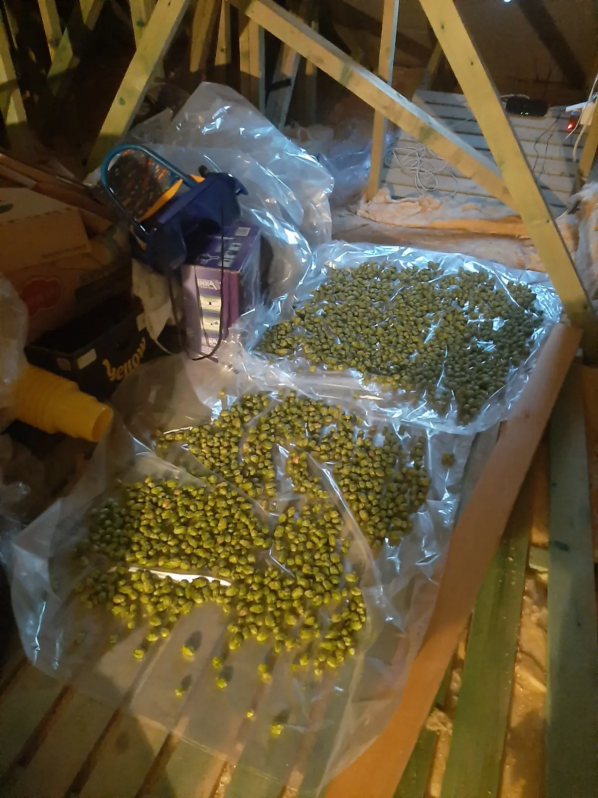
