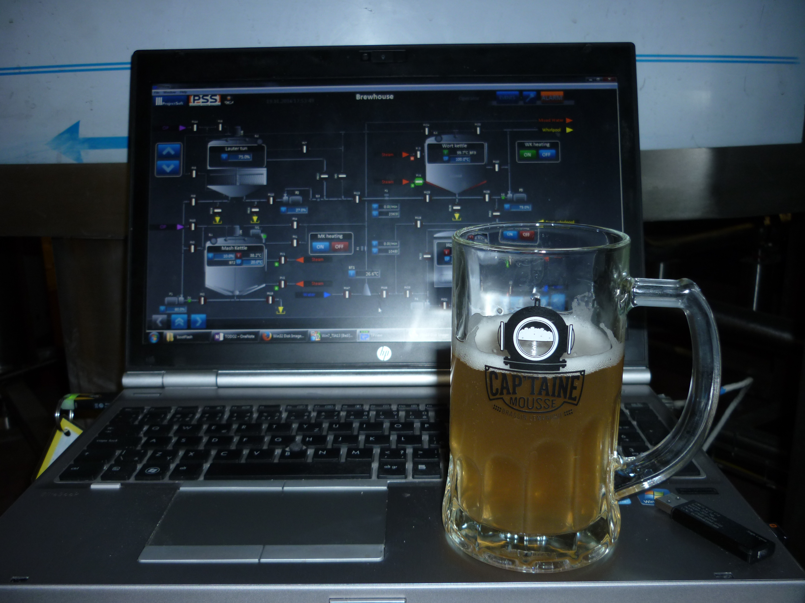
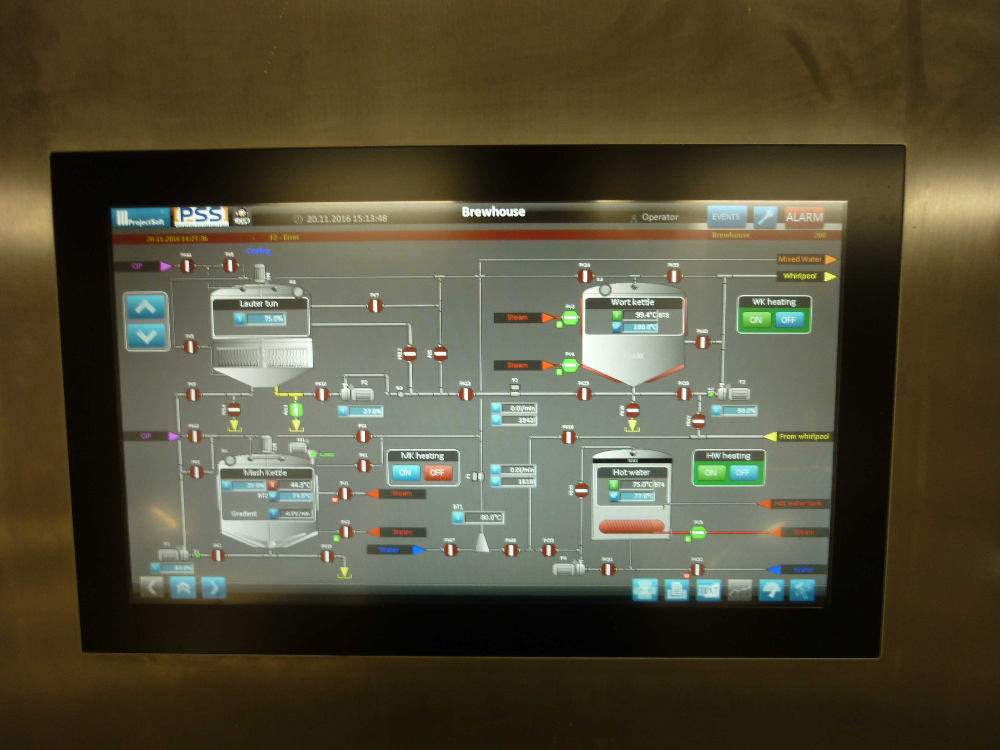

## Úvod – motivace ke stavbě minipivovarku

Stavbu vlastní varny jsem zahájil v dubnu 2021. Inspiraci jsem načerpal jednak ze své práce ve firmě **ProjectSoft HK**, kde jsem se podílel na řízení cukrovarů a pivovarů, jednak z návštěvy minipivovarku **Captaine Mousse ve Švýcarsku** – šlo o čtyřnádobovou varnu s kapacitou 50 hl, která mě naprosto uchvátila.

### Představa

Cíle, které jsem si stanovil:

- **Plná automatizace** – minimální lidská obsluha v průběhu vaření
- **Dotykový displej** – přehledné ovládání
- **Opakovatelnost** – konzistentní výsledky mezi jednotlivými vářkami
- **Objem 30 l a více** – dostatečná kapacita pro domácí potřeby
- **Ležáky** – schopnost varny zvládnout spodně kvašená piva

### Kam to dát

Jedním z klíčových problémů bylo místo pro varnu. Řešením se ukázalo kombinovat plánovanou stavbu nádrže na dešťovou vodu s minipivovarkem – vybudovat sklípek s varnou v jednom celku. Tento přístup přinesl řadu výhod:

- Dešťová voda slouží ke chlazení mladiny bez zbytečných ztrát vody
- Blízkost pitné vody pro přípravu piva
- Předpřipravené kabelové rozvody

### Automatické rmutování

Původně jsem uvažoval o peristaltickém čerpadle pro cirkulaci rmutové kaše, ale záhy se ukázalo, že pro hustý rmut je toto řešení nevhodné. Proto jsem přistoupil k návrhu **gravitačního systému spojených nádob s tlakovým vzduchem** pro přečerpání kaše zpět – inspiraci jsem čerpal z následujícího videa:

[Inspirace pro gravitační rmutování (YouTube)](https://www.youtube.com/watch?v=6gl_GT96D1w&t=100s)

