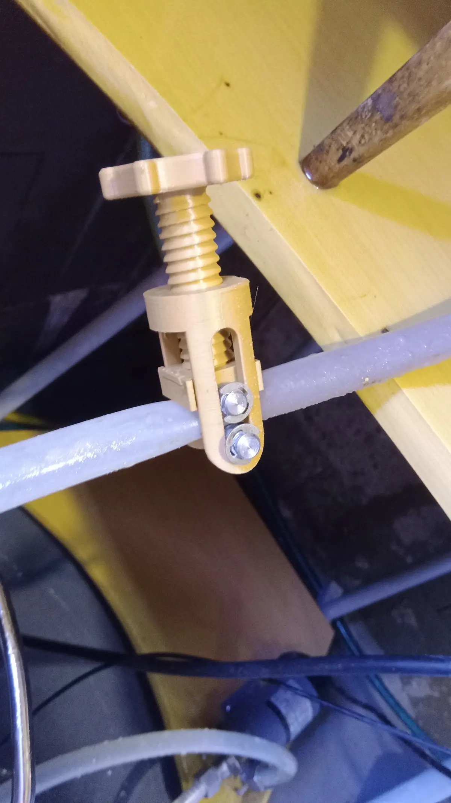
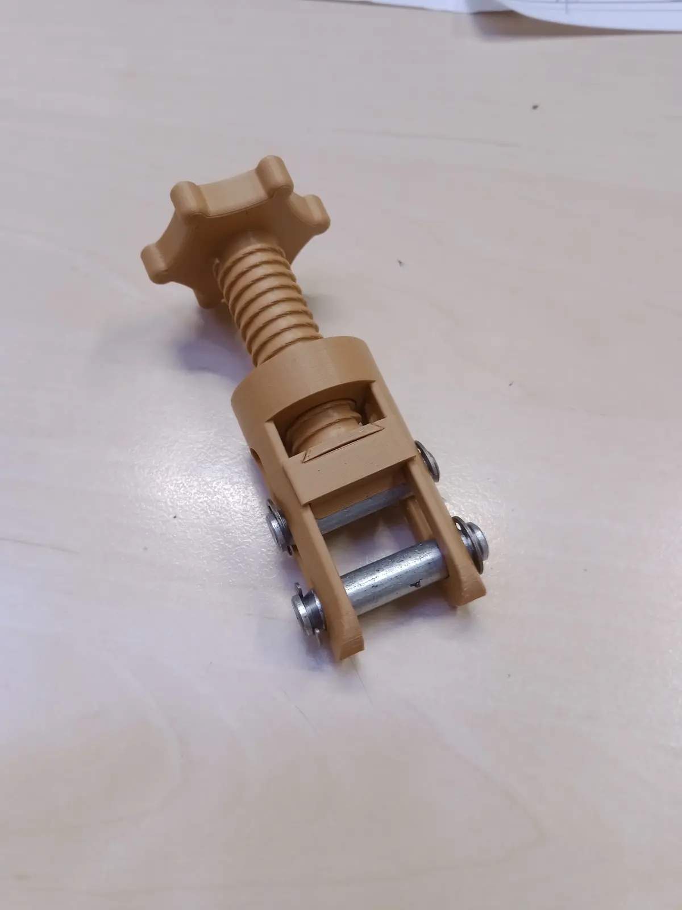

## Clamp for Sparging and Lautering

Instead of using a metal hose clamp, I opted for a **3D-printed solution** found online.

### Model

[Hose Clamp – Printables](https://www.printables.com/model/363963-hose-clamp)

### Printing and Material

- **Material:** PETG or ASA – suitable for food contact and resistant to higher temperatures
- Printed without major issues

### Modifications

Instead of the original **metal pins**, I used **plastic clips**:

- Eliminates the risk of corrosion
- Simplifies assembly
- Reduces cost

### Usage

The clamp regulates hose flow from full flow down to complete shutoff. Ideal for:

- **Lautering** the mash
- **Sparging** (rinsing water)
- General hose switching in the brewhouse

