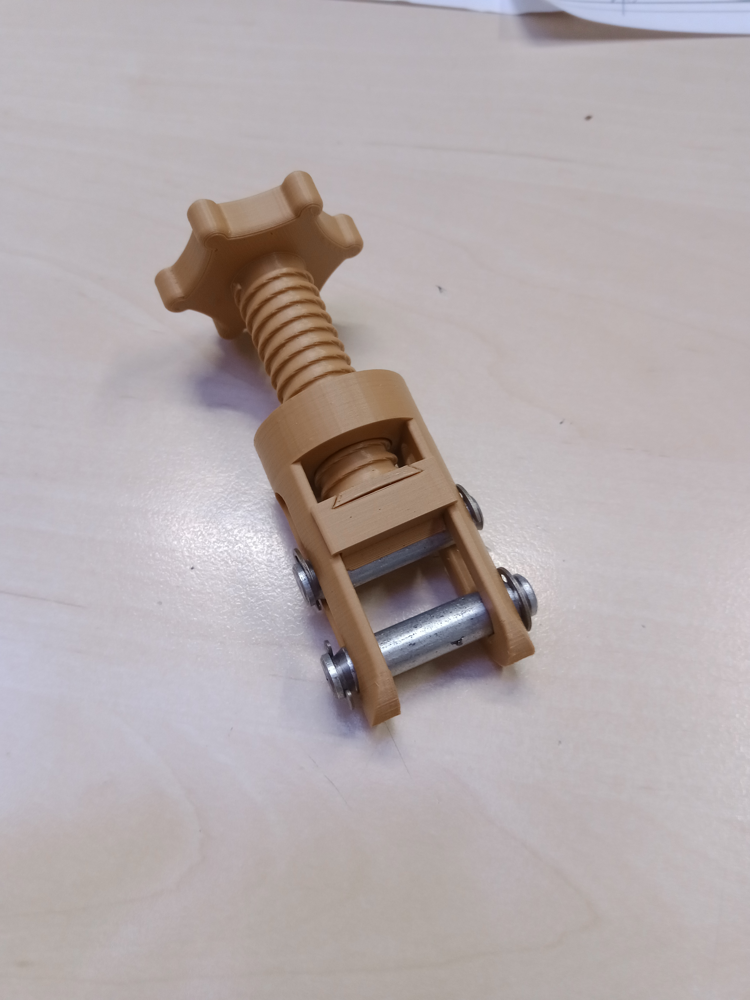

## Škrtidlo na vyslazování a scezování

Místo kovového škrtidla jsem sáhl po **3D tisknutém řešení** nalezeném na internetu.

### Model

[Hose Clamp / Škrtidlo na hadičku – Printables](https://www.printables.com/cs/model/363963-hose-clamp-skrtidlo-na-hadicku)

### Tisk a materiál

- **Materiál:** PETG nebo ASA – vhodné pro kontakt s potravinami a odolné vůči vyšším teplotám
- Tisk bez větších komplikací

### Úpravy

Místo originálních **kovových hřídelek** jsem použil **plastové klipsy**:

- Eliminuje riziko koroze
- Zjednodušuje sestavení
- Snižuje náklady

### Použití

Škrtidlo reguluje průtok hadicí od plného průtoku po úplné uzavření. Ideální pro:

- **Scezování** rmutové kaše
- **Vyslazování** (splachovací vody)
- Obecné přepínání hadiček ve varně

