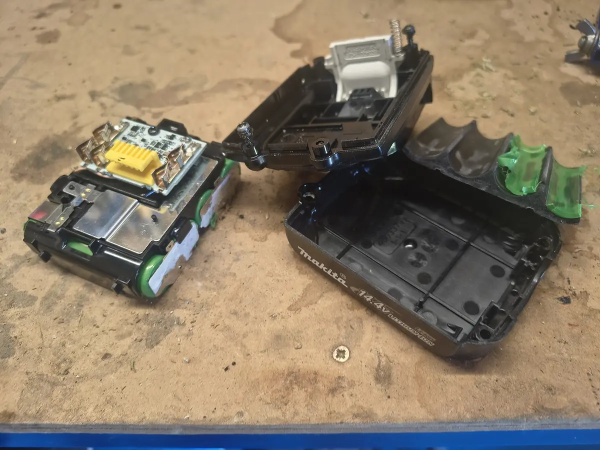
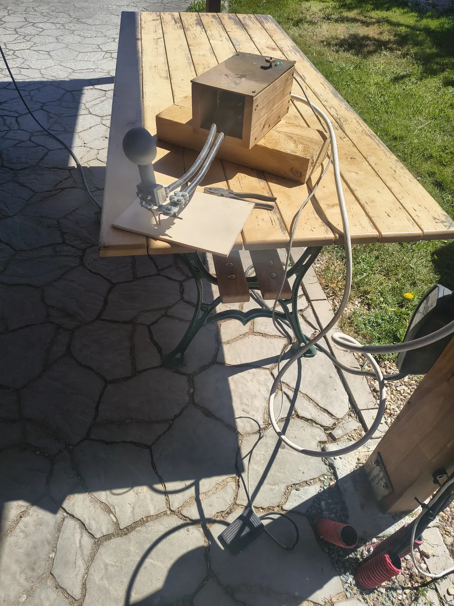

Being able to repair faulty acumulators are very useful. After building Spot-welder from microwave owen transformer ([see guide how to build it](https://www.instructables.com/Spot-Welder/) or choose from many other guides on internet) it is very effortless and quick process.

Except the manufacturers are making it harder to open sometimes. This Makita acumulator had non-standart screw heads, star-shaped with stick in the center. I just drilled it. The plastic melted by temperature so it was easy to pull it out even before it drills through.
I was replacing also Parkside's some time ago and i thing that was much easier.





When i pull out cells from my pack, they have damaged wrapping so i put new one and use hot-air gun to wrap them. The protecting rings were ok. These wraps are cheap and easily obtainable for example on Aliexpress.


Here on the left picture you can see some puzzle-3D-printed holders. They are useful and you can assemble various battery packs with it.

Spotwelder, very usefull tool. [See guide how to build it](https://www.instructables.com/Spot-Welder/)


