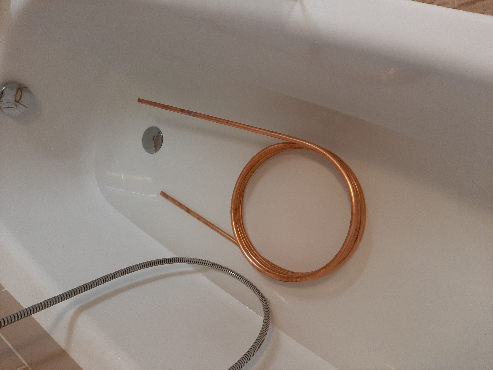

## Making copper spiral tube

For my DIY microbrewery I needed two copper coils:

1. **HERMS coil** – for heating the mash by circulating it through hot water
2. **Wort chiller coil** – for rapidly cooling the wort after boiling

Copper was the obvious choice: it has roughly **20× better thermal conductivity** than stainless steel, significantly reducing heat exchange time. Durability was less of a concern since I won't be brewing 24/7; cleaning in citric acid handles any oxidation.

## Parameters

- **Cu pipe: 12×1 mm half-hard, 5 m**
- Price: **515 CZK** (~21 USD)
- Source: [triker.cz – Cu pipe 12×1 mm half-hard](https://triker.cz/p-190276010121/Cu-trubka-medena-supersan-12-x-1-mm-polotvrda/)

## Procedure

1. Fill the pipe with **salt** – this prevents kinking during bending
2. Wind the pipe around a **drain pipe** used as a mandrel (my wife helped by walking around it :D)
3. Shape into the desired coil diameter

## Getting the salt out

This turned out to be the hardest step. After bending, the salt was compacted and nothing worked – pressurised water, knocking, even vinegar. The solution:

1. Connect a **garden hose** to one end and pressurise
2. **Close the valve** and leave for **1–2 hours**
3. Open the valve – the built-up pressure forces the salt out

It took 2 hours but it worked. It turns out others have had the same problem:  
[How to get the bloody salt out – Tapatalk](https://www.tapatalk.com/groups/modelsteam/how-to-get-the-bloody-salt-out-t65003.html) (the author there used compressed air instead).

